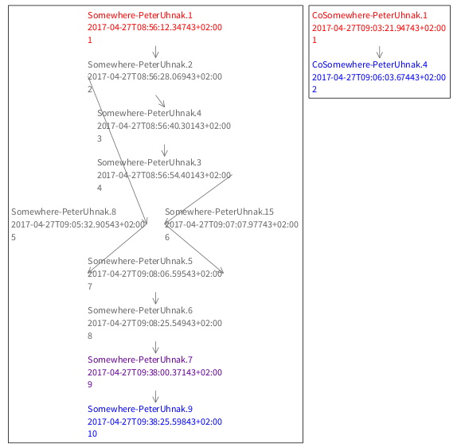
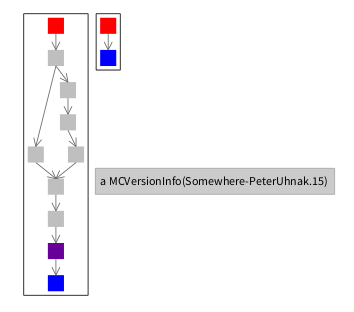
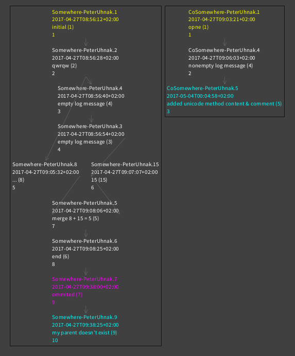
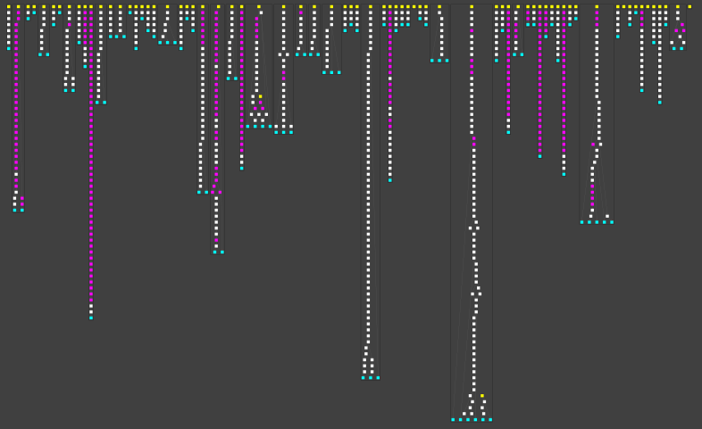

# MCZ -> Git Migration
[](https://travis-ci.org/peteruhnak/git-migration) [](https://coveralls.io/github/peteruhnak/git-migration?branch=master)

Utility to migrate code from SmalltalkHub (or any MCZ-based repo) to Git.

The output is in **Tonel** format.


## Installation

**Pharo 7**

```smalltalk
Metacello new
	baseline: 'GitMigration';
	repository: 'github://peteruhnak/git-migration/repository';
	load
```

For Pharo 6, see further down.


Table Of Contents

* [Possible Issues](#possible-issues)
* [Installation](#installation)
* [Usage - Fast Import](#usage---fast-import)
* [Extras](#extras)
* [Visualizations](#visualizations)
	* see pretty pictures of your MCZ history before you decide to migrate
* [For Developers](#for-developers)
	* digging in the internals


## Possible Issues

This tool has been used in countless successful migrations, however it is possible that you will run into a very special™ edge case. Feel free to open an issue or contact me directly on Pharo's mailing list or Discord.

* performance - Git's fast-import is used to move the data. On Pharo side (generating import file) it will take couple minutes for large repos (caching every single version, unzipping, transforming, ...). On Git side it will take about a second. (PolyMath with 800 commits accross 70 packages took ~3 minutes generating 90MB import file)
* relying on dependencies specified in MC Versions (=NOT ConfigurationOf/BaselineOf) -- not supported
* preserving proper merge history (see  also [#4](https://github.com/peteruhnak/git-migration/issues/4))
	* after many hours burned on this I've concluded that there is no way to do a fully automated 1:1 migration; note that your data/commits are not lost, only the merge history will not be as rich.

## Prerequisites

* git installed in the system and available in `PATH`
* **Pharo 6+**

## Installation - Pharo 6

**Pharo 6**

**NOTE** Please note that new features are _not_ backported to Pharo 6 branch. GitMigration doesn't actually load your target project into the image, so there should be no practical reason to migrate in P6 instead of P7.

**NOTE 2** Pharo 6 version will output FileTree format; for Tonel please use Pharo 7.

```smalltalk
Metacello new
	baseline: 'GitMigration';
	repository: 'github://peteruhnak/git-migration:pharo6/repository';
	load
```

## Usage - Fast Import

Fast Import generates a file for [git-fast-import](https://git-scm.com/docs/git-fast-import).

### Example

```smalltalk
"Pharo"
migration := GitMigration on: 'peteruhnak/breaking-mcz'.
migration cacheAllVersions.
migration authors: {'PeterUhnak' -> #('Peter Uhnak' '<i.uhnak@gmail.com>')}.
migration
	fastImportCodeToDirectory: 'repository'
	initialCommit: '5793e82'
	to: 'D:/tmp/breaking-mcz2/import.txt'
```

```bash
# Terminal
cd D:/tmp/breaking-mcz2
git fast-import < import.txt
git reset --hard master
git gc
```

### 1. Add Source Repository

Add your source repository (SmalltalkHub) to Pharo, e.g. via Monticello Browser

### 2. Find The Initial Commit SHA

The migration will need to know from which commit it should start. This will be typically the SHA of the current commit of the master branch; you don't need the full 40-char SHA, an unambiguous prefix is enough.

The get the current commit, you can do the following

```bash
$ git log --oneline -n 1
```

### 3. Generating Import File

*A longer description of the example above.*

```smalltalk
"Specify the name of the source repository; I am sourcing from peteruhnak/breaking-mcz project on SmalltalkHub"
migration := GitMigration on: 'peteruhnak/breaking-mcz'.

"Download all mcz files, this will take a while"
migration cacheAllVersions.

"List all authors anywhere in the project's commits"
migration allAuthors. "#('PeterUhnak')"

"You must specify name and email for _every_ author"
"You must also specify the name/email for yourself (Author fullName), even if you haven't authored any code -- git treats separately the author of a commit and the commiter of a commit"

"AuthorName (as shown in #allAuthors) -> #('Nicer Name' '<email@example.com>')"
migration authors: {
	'PeterUhnak' -> #('Peter Uhnak' '<i.uhnak@gmail.com>')
}.

"Run the migration, this might take a while
* the code directory is where the code will be stored (common practice is to have the code in `repository` subfolder, just like this project)
* initialCommit is the commit from which the migration should start
* to is where the git-fast-import file should be stored"
migration
	fastImportCodeToDirectory: 'repository'
	initialCommit: '5793e82'
	to: 'D:/tmp/breaking-mcz2/import.txt'
```

### 4. Running The Import

Get a terminal, go to the target git repository, and run the migration.

```bash
# import.txt is the file that you've created earlier
$ git fast-import < import.txt
# fast-import doesn't change the working directory, so we need to update it
$ git reset --hard master
# (optional) garbage collection: fast import leaves a lot of mess behind
# happens automatically on commit since Git >=2.17
$ git gc
```

You should see the changes, and `git log` should show you the entire history.

## Git Tips

Forgetting all changes in the history and going back to previous state. Useful if the migration is botched and you want to rollback all changes.

```bash
$ git reset --hard SHA
```

## Extras

If you want to play around with the version data before committing, read the following.

```smalltalk
migration := GitMigration on: 'peteruhnak/breaking-mcz'.
```

Downloading all MCZs from server; this needs to happen only once and can take couple of minutes for large repos.

```smalltalk
migration cacheAllVersions.
```

List all packages in the repository that have multiple roots; although rare, this could be either result of multiple people starting independently on the same package, or a mistake was made during committing.
GitMigration should be able to handle this correctly regardless.
```smalltalk
migration packagesWithMultipleRoots.
```

List all authors in the repository.
```smalltalk
migration allAuthors.
```

Dictionary of all packages and their _real_ (see later what's real) commits.
```smalltalk
versionsByPackage := migration versionsByPackage.
```

*All* versions of a package, whether there is actually an MCZ or not. With Monticello it is very easy to create a commit whose ancestor is not in the repository, so it is not obvious how the commit connects the previous ones.
Thankfully MCZ typically contains the hierarchy many steps back, so we can correctly reconstruct the whole tree.
```smalltalk
allVersions := migration completeAncestryOfPackageNamed: 'Somewhere'.
```

The versions in mcz are random, so we need to sort them in an order in which we can commit them to git. This means that all ancestry is honored (no child is commited before its parent), and "sibling" commits are sorted by date.
Note that we cannot just sort the commits by date, because the date might not follow the ancestry correctly (which can happen, especially if different timezones are involved, which MC doesn't keep track of)
```smalltalk
sorted := migration topologicallySort: allVersions.
```

Get the total ordering of all commits across all packages
```smalltalk
allVersionsOrdered := migration commitOrder.
```

## Visualizations

This requires [Roassal](http://agilevisualization.com/) to be installed (available in catalog).

In all visualizations hovering over an item will show a popup with more information, and clicking on item will open an inspector.
Keep in mind that running the command will not open a new window, so you have to either inspect it, or do-it-and-go in playground.

### Single Package Ancestry

Looking at raw data is not very insightful, so couple visualization are included.

```smalltalk
migration := GitMigration on: 'peteruhnak/breaking-mcz'.
migration cacheAllVersions.
visualization := migration visualization.
```

Show the complete ancestry of a single package.
```smalltalk
visualization showAncestryTopologyOnPackageNamed: 'Somewhere'.
```



* Yellow - root versions (versions with no parents, typically only a single initial commit)
* Cyan - tail/head versions (versions with no children, typically the latest version(s))
* Magenta - "virtual" versions that do not have a corresponding commit (this happens as mentioned earlier)

The number on the third line indicates in what order the packages will be committed (magenta packages are listed, but are not committed, because there is no code to commit).
Keep in mind that the number in the commit (Somewhere-PeterUhnak.15) has no meaning, and can be easily changed (and broken by hand) when committing.


### Project Ancestry

To see all packages and history, you could do.

```smalltalk
visualization showProjectAncestry.
```



This is useful if you want to quickly glance at a project (and is also much faster to generate and use), but if want you can also add label

```smalltalk
visualization showProjectAncestryWithLabels.
"or"
visualization showProjectAncestryWithLabels: true.
```




### Limited Project Ancestry

If you have big project and want to look only at certain packages, you can do so. (In the image you can see that the longest chain has ancestry broken - red box at the end)

```
migration := GitMigration on: 'PolyMath/PolyMath'.
migration cacheAllVersions.
visualization := migration visualization.
"or just a collection of package names"
visualization showProjectAncestryOn: (allPackages copyWithoutAll: #('Monticello' 'ConfigurationOfSciSmalltalk'  'Math-RealInterval')).
```



Adding labels works the same way

```
visualization showProjectAncestryOn: aCollectionOfPackages withLabels: aBoolean
```

## For Developers

Some hints and random thoughts.
SmalltalkHub stores every commit in a separate MCZ file, which contains some metadata about the commit (name, ancestry, etc), as well as all the code. The code itself is not incremental, rather code in each zip is as-is.

This means that when GitFileTree is exporting, it will remove all files on the disk, unpack the MCZ file, and write all the code back to disk, and commit. Git is smart enough to only commit what has actually changed, however for GFT this operation is very IO intense - if you have 5k files in your code base and you changed just a single method (which is common), then 5k files will be removed and then added back... you can imagine what this does to the disk when performed 1000x times (once for each commit).

With fast-import I've made a workaround for this. A pseudo-repository `GitMigrationMemoryTreeGitRepository` is created that uses memory file system as the target directory. This way the fileout doesn't write to real disk and everything is kept in RAM, which improves the performance significantly.

Note however that instead of using `MemoryStore` I had to subclass it (`GitMigrationMemoryStore`) to properly handle path separators; on Windows, MemoryStore by itself will create files and directories with slashes (both forward and backward) in their names instead of creating a hierarchy, so my `GitMigrationMemoryStore` fixes this.

I am also subclassing `MemoryHandle` (`GitMigrationMemoryHandle`) and I've changed the `writeStream` of it to return `MultiByteBinaryOrTextStream`. This is because `MemoryStore` returns only an ordinary `WriteStream` which cannot handle unicode content and 那不是很好。 :)
